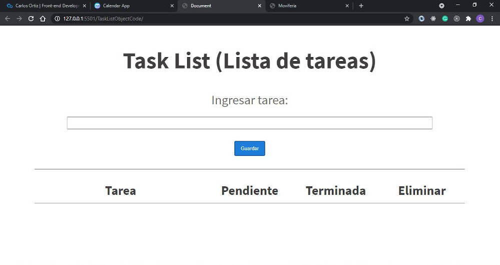
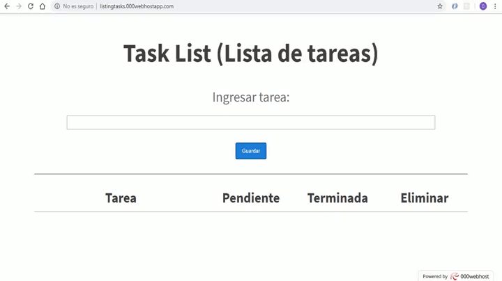
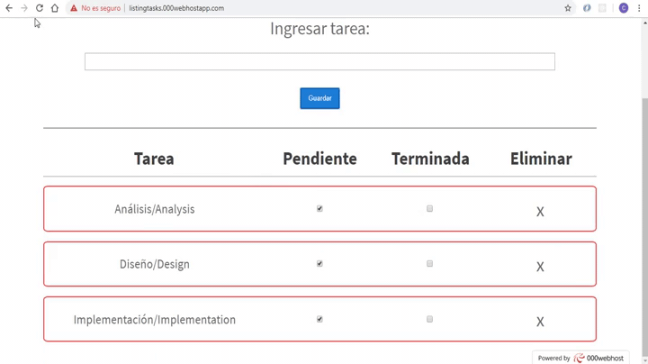
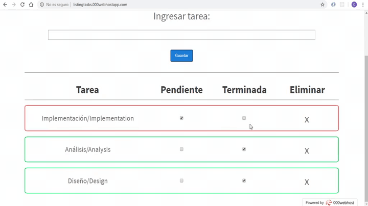

# To-Do List App
To-Do List enables us to add some tasks in a table, which one tries to sort out these tasks like done tasks and undone tasks, positioning the undone tasks at the beginning and the done tasks at the end of the table. This project was built with HTML, CSS, and JavaScript.

<h2 align='center'><a href='https://todolist.carlosortiz.dev/'>Check it live here</a></h2>

## Usage

* ### Add a task
Tasks are added as undone tasks with a red border line:

* ### Check your done tasks
Turn your undone tasks to done tasks by clicking in the done check input.

All done tasks are identified by a green borderline and they are positioned at the bottom of the list:

* ### Reload the page or come back later
Tasks are saved in Local Storage to conserve any change you make:

## Installation
Clone the repository and just open the index.html file in the browser

## Contributing
Please feel free to send pull request if you want to contribute!

## Authors

- **Carlos Ortiz** - _Development_ - [CharlieOrtiz](https://github.com/CharlieOrtiz)